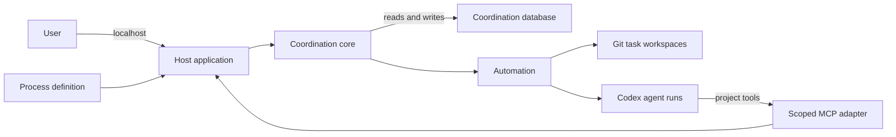

# Architecture overview

The Agent Coordination Framework is a local application that coordinates
role-focused coding agents through configurable boards. A user defines the
workflow in a Git repository, supervises it in a browser, and retains all task,
agent-run, and workspace state on the same machine.

This document is a map of the implemented system, not an inventory of source
files or a complete behavioral reference. Use [CONTEXT.md](../CONTEXT.md) for
domain language, the [ADRs](adr/) for decision history, and the focused guides
linked below for detailed contracts and operations.

## Architecture at a glance

The framework is one host-native Node application served on localhost. The
browser interface and agent-facing MCP tools are adapters around the same
coordination core. The core owns all workflow rules and authoritative changes;
neither adapter writes state independently.

Codex remains the agent runtime. The framework supplies task and process
context, an isolated Git workspace, and scoped coordination tools, but it does
not reimplement models, sessions, authentication, or general coding tools.

## Major parts

### Host and user interface

The host is the composition and lifecycle boundary. It resolves project state,
loads the process definition, starts the coordination core, serves the React
browser application, and exposes local HTTP endpoints.

The browser is a presentation adapter. It provides boards, task details,
history, transcripts, automation controls, and accessible task movement. It
does not own workflow or automation policy.

### Coordination core

`CoordinationApplication` is the shared command-and-query boundary for every
user and agent interaction. It applies task, relationship, activation,
attention, archival, and process-evolution rules, and exposes projections for
inspection.

Complete user-facing board and task-detail read projections are assembled
inside this boundary before the web adapter serializes them. The adapter does
not reconstruct those authoritative views by coordinating lower-level queries.

The core records a command's state change, activity provenance, projection
updates, and idempotent response together. This is the central architectural
choice: the UI and agents collaborate through one authoritative model rather
than through separate state that must later be reconciled.

### Durable state

SQLite stores the live coordination model: boards, tasks, comments,
relationships, activity, activations, agent conversations, attempts, attention,
and automation state. Conversations retain task, owner, originating activation,
and current-thread identity; their run evidence stays in the existing
attempt-scoped transcript store. Read projections aggregate that evidence for
the browser without becoming a second source of truth or duplicating it. Each
conversation record persists a generated originating-request label and durable
activity order; a task-scoped compact projection exposes that indexing metadata
so task details can navigate recent history without loading transcript evidence.
User follow-ups pass through a focused internal conversation command module.
One application transaction records the authored message,
`conversation.continued` activity, `user-follow-up` activation, conversation
activity order, and idempotent response while enforcing ownership and
continuation availability.
Archival retains the conversation, activation, and coordination-activity lineage
but removes its attempt transcripts and authored follow-up bodies. It also removes
cached continuation-command responses that duplicate those bodies, so archived
history cannot recover detailed conversation content through an idempotency replay.

The database is outside the project checkout and is kept with the task
workspaces in one bound project state root. Startup validates that retained
state rather than silently replacing or adopting inconsistent data.

### Automation and agent runtime

Automation turns committed activation records into agent runs. It preserves the
order of activations for each task, prevents overlapping runs on one task, and
allows independent tasks to run concurrently. Automation always starts paused
and proceeds only after the user resumes it.

For each run, the Codex adapter starts or resumes a thread in the task's Git
workspace. A per-attempt MCP adapter lets that agent inspect relevant project
coordination state and mutate only its current task. Every activation owns a
durable task-scoped agent conversation; retries remain in that conversation,
while each attempt's messages and tool activity remain separately attributable
run evidence.
For a `user-follow-up` activation, runnable selection still uses the ordinary
task activation order and safety gates, but dispatch resolves the conversation's
current thread as the resume target. It uses the conversation's immutable owning
agent, current applied instructions, verified existing task workspace, and a new
attempt-scoped MCP authorization; the runtime releases that authorization through
the normal attempt lifecycle.
If Codex cannot resume that thread, the runtime marks the attempt's continuity as
replaced while adopting the replacement thread as the conversation's next resume
target. Conversation projections retain and display that marker so the replacement
is not presented as preserved model history.

### Git task workspaces

Each task receives one isolated Git worktree, initially detached at the
process-defined starting reference and reused across all of that task's runs.
The framework provisions and verifies the workspace; the process and its agents
decide how branches, commits, and handoffs are managed.

Workspace identity spans the coordination database, filesystem directory, and
Git worktree registration. These are validated together because disagreement
between them can make an agent operate on the wrong work.

Host-side archival first matches the database workspace path to the task's
framework-owned location and its primary-repository worktree registration.
Only then do Git commands executed inside that worktree receive its exact path
as process-local `safe.directory` configuration. The trust applies to that Git
subprocess only; the host never broadens it to the workspace root or writes
global or repository Git configuration.

Archival keeps workspace inspection separate from removal. Dirty state and a
non-durable commit remain user-correctable safety outcomes; invalid
registration, rejected ownership trust, a worktree lock, unexpected inspection
failure, and actual removal failure remain distinct host outcomes. The task is
marked archived only after Git reports successful worktree removal.

## State ownership

| State | Owner | Location |
| --- | --- | --- |
| Workflow structure and agent instructions | User and project | Version-controlled process files in the project repository |
| Boards, tasks, activity, activations, run history, notification policy, and eligible notification occurrences | Coordination framework | SQLite in the bound project state root |
| Task implementation work | Process and agents | One Git worktree per task in the same state root |
| Appearance, notification consent, and operating-system permission | Browser and operating system | Browser-local storage and browser permission state |

The project repository is bound to its state root through repository-local Git
configuration. The database and task worktrees form one recovery and relocation
unit; live coordination state is not stored in the primary checkout or inside
an agent's task workspace.

## End-to-end flow

1. A user or agent submits a command through its adapter.
2. The coordination core validates the command and commits the state change,
   immutable activity, and any resulting activation atomically.
3. When automation is running, it claims the next eligible activation for a
   task and prepares or verifies that task's Git workspace.
4. Codex receives the activation reason plus the current task, process, role,
   collaborator, attempt, and workspace context.
5. The agent works in the task workspace and coordinates through its scoped MCP
   tools. Tool commands return to the same coordination core used by the user.
6. The framework records the attempt outcome and transcript. A successful run
   does not move the task implicitly; workflow changes require an explicit
   command from the user or agent.

Notification delivery follows the same authority boundary: a task command or
actionable run failure evaluates the durable process policy while recording the
event and persists an eligible occurrence. Open browser clients poll forward
from a cursor, advance past every observation whether or not local delivery is
available, and make one best-effort operating-system delivery attempt. Opening
or reloading a client starts at the current cursor, so missed or silenced
occurrences are never replayed. Settings mutates policy through
`CoordinationApplication`; browser permission and Appearance never enter the
coordination database.

## Architectural principles

- **One authority:** all coordination commands and queries pass through the
  application boundary; UI, MCP, and runtime adapters do not write SQLite
  directly.
- **Durable provenance:** stable process identities, activation reasons,
  activity, and attempt history are retained rather than inferred later.
- **Explicit workflow:** agent completion does not imply board movement, and
  process changes are not silently applied to stale work.
- **Isolated work:** each task has its own verified Git workspace, while shared
  coordination state remains outside every workspace.
- **User-controlled execution:** startup is paused, interruption and permission
  blocks are visible, and recovery requires an explicit supported action.
- **Fail closed:** inconsistent binding, storage, process, or workspace state
  produces an inspectable configuration error instead of automatic repair.
- **Adapter discipline:** React owns presentation, Codex owns agent execution,
  and MCP owns tool transport; domain and automation rules stay in the core.

## Further detail

- [Process-definition reference](process-definition-reference.md) documents the
  YAML authoring and validation contract.
- [Agent MCP tool reference](agent-mcp-reference.md) documents the agent-facing
  tools and response shapes.
- [Project-state backup and restore](project-state-backup-and-restore.md)
  documents the recovery unit and operating procedure.
- [Development setup](development-setup.md) documents the source toolchain and
  local startup procedure.
- [Architecture decisions](adr/) explain why the product owns its board, runs
  host-native, uses React and Vite, binds state beside the project, and relocates
  state through an offline command.

## Keeping this overview current

Update this document when a major component, authoritative boundary, state
owner, or end-to-end flow changes. Keep source-level structure in the code,
external contracts in their reference documents, operating instructions in
their guides, and the reasoning for durable choices in ADRs. A feature that fits
the architecture above does not need to be added here merely because it exists.
