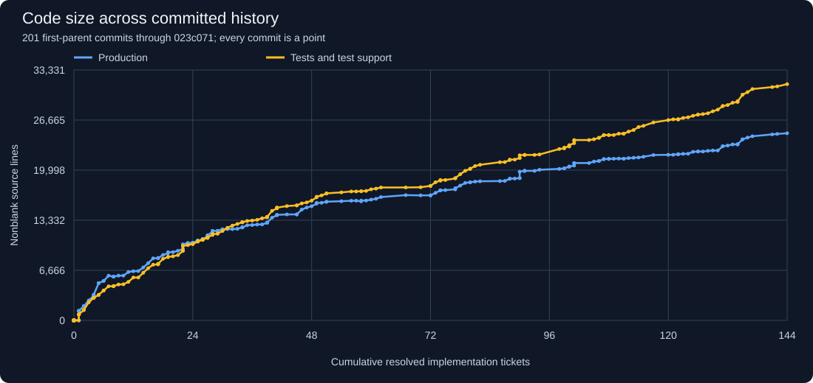
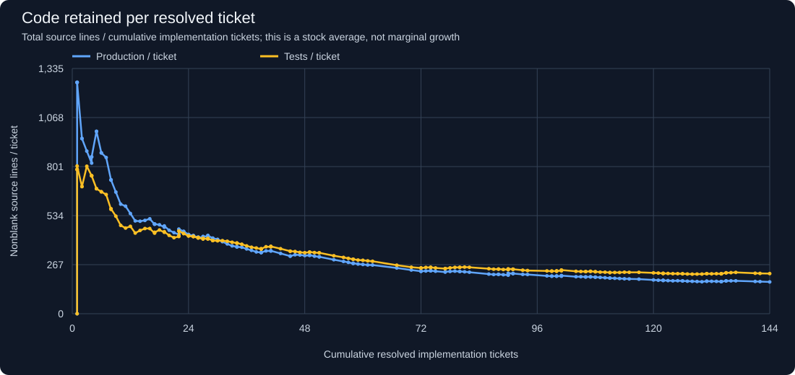
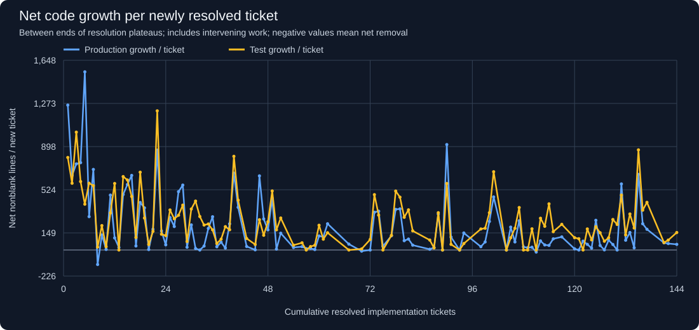

# Project growth snapshot

Committed history through `023c071621914eafdf16228e9dd2a9d6ca18d15e` (2026-10-02). This report samples all
201 commits on the first-parent history of that commit. Working-tree and
staged changes are excluded. Charts are local SVGs embedded in Markdown; no
server, external libraries, or network connection is needed.

## Code size against resolved implementation tickets



Each point represents one commit, in history order. X is the number of distinct
implementation tickets observed resolved by that commit. Commits without a new
resolution retain the same X coordinate, so vertical movement is meaningful.
Hover a point when viewing the SVG directly to inspect its commit and totals.

**Red diamonds mark 24 maintenance commits on both curves.** The
blue and yellow lines still identify production and tests. Open
[the SVG directly](project-growth/size.svg) and hover a red diamond for its commit,
maintenance scope, and immediate net line changes. The evidence table below
lists every marked commit.

| Metric at endpoint | Count |
| --- | ---: |
| Resolved implementation tickets, cumulative | 144 |
| All resolved tickets, cumulative (including decisions/research) | 167 |
| Tickets currently marked resolved at endpoint | 167 |
| Production source lines | 24,913 |
| Test and test-support source lines | 31,444 |
| Production source files | 141 |
| Test and test-support source files | 89 |
| Prototype source lines (excluded from main charts) | 2,289 |
| Generated schema snapshot lines (excluded) | 359 |

At this endpoint, the project retains 173.0
production lines and 218.4 test lines per
resolved implementation ticket. Tests contain 1.26 times
as many source lines as production; this ratio measures size, not test quality.
The broad intervals below make it possible to compare early build-out with
later development without assuming equal feature size.

## Retained code per ticket



This divides the current code size by cumulative resolved implementation tickets.
A falling line means less retained code per resolved ticket. It does not imply
that a particular ticket removed code, nor measure engineering effort.

## Net growth per additional ticket



For this chart, take the **last commit at each cumulative ticket count** and
compare adjacent counts: change in lines divided by change in resolved tickets.
This includes fixes and refactoring between resolutions and after a resolution
until the next count increase. A commit resolving several tickets contributes
one interval averaged across those tickets. It measures net retained growth,
not gross added lines or total churn. The last plateau ends at the snapshot
endpoint; later updates can change that last interval.

Broader intervals reduce the noise of individual tickets:

| Resolved-ticket interval | New tickets | Net production lines / ticket | Net test lines / ticket |
| --- | ---: | ---: | ---: |
| 0–20 | 20 | 454.1 | 426.4 |
| 20–40 | 20 | 229.4 | 302.6 |
| 40–60 | 20 | 120.1 | 143.4 |
| 60–80 | 20 | 115.2 | 137.4 |
| 80–100 | 20 | 105.2 | 156.5 |
| 100–120 | 20 | 77.8 | 166.8 |
| 120–141 | 21 | 129.5 | 209.1 |
| 141–144 | 3 | 51.3 | 130.0 |

Linear code-size growth would look roughly straight in the first chart and
roughly flat in net growth per ticket. Sustained exponential growth would need
progressively increasing marginal growth over a substantial range. These are
descriptive charts, not a fitted growth model; tickets vary in size and include
maintenance, bugs, and implementation spikes as well as product features.

## Maintenance commits highlighted in red

The reviewed [classification](project-growth/maintenance-classification.json)
includes the five dedicated maintainability/verification efforts, nine individual
organizational refactoring tickets, and two early extraction commits identified
from their diffs. For tickets, the marker is the commit where resolution was first
recorded, consistent with the chart's ticket counting. Research-only decisions,
ordinary bug fixes, and feature delivery are excluded from this classification.
The dedicated efforts include verification work as well as structural refactoring.

The two additional early commits cover maintenance before completion bookkeeping.
Other preparatory or follow-up commits without a newly resolved classified ticket
are not automatically marked. Thus the markers locate the reviewed maintenance
deliveries, not every historical edit that could be called maintenance. Future
efforts can be added to the classification when updating the report.

The deltas below compare each marked commit with its immediate preceding
first-parent commit, including any other work in that commit. They are not
causal estimates or totals attributable exclusively to the listed tickets.
The X values are cumulative implementation-ticket counts, not tracker ticket IDs.

| Marker | Commit | Chart X | Net production lines | Net test lines | Maintenance evidence |
| --- | --- | ---: | ---: | ---: | --- |
| M1 | `8251169` | 4 | +135 | +0 | Early split of application, contracts, database, automation, and discovery modules; predates dedicated maintenance tickets |
| M2 | `7de3845` | 8 | -130 | +2 | [29-decompose-coordination-persistence](../.scratch/agent-coordination-framework/issues/29-decompose-coordination-persistence.md) |
| M3 | `dbfd041` | 13 | +22 | +0 | [41-separate-task-projections-from-commands](../.scratch/agent-coordination-framework/issues/41-separate-task-projections-from-commands.md) |
| M4 | `dcb5d47` | 51 | +14 | +34 | Initial user-board projection extraction and creation of the first maintainability effort, before its tickets were marked resolved |
| M5 | `a85bb76` | 54 | +65 | +126 | [01-complete-user-board-projection](../.scratch/codebase-maintainability/issues/01-complete-user-board-projection.md), [02-complete-user-task-detail-projection](../.scratch/codebase-maintainability/issues/02-complete-user-task-detail-projection.md), [03-shared-accessible-modal-lifecycle](../.scratch/codebase-maintainability/issues/03-shared-accessible-modal-lifecycle.md) |
| M6 | `bf4b74f` | 56 | +58 | +125 | [04-shared-refresh-and-polling-lifecycle](../.scratch/codebase-maintainability/issues/04-shared-refresh-and-polling-lifecycle.md), [05-single-durable-activity-journal](../.scratch/codebase-maintainability/issues/05-single-durable-activity-journal.md) |
| M7 | `c3dccb1` | 57 | +12 | +0 | [06-atomic-attention-recording](../.scratch/codebase-maintainability/issues/06-atomic-attention-recording.md) |
| M8 | `fc1fe11` | 58 | -92 | +30 | [07-idempotent-command-execution-module](../.scratch/codebase-maintainability/issues/07-idempotent-command-execution-module.md) |
| M9 | `a171ffb` | 67 | +256 | +0 | [08-structured-idempotent-command-identity](../.scratch/codebase-maintainability/issues/08-structured-idempotent-command-identity.md), [09-conversation-projection-module](../.scratch/codebase-maintainability/issues/09-conversation-projection-module.md), [10-conversation-command-module](../.scratch/codebase-maintainability/issues/10-conversation-command-module.md), [11-expand-capability-focused-contracts](../.scratch/codebase-maintainability/issues/11-expand-capability-focused-contracts.md), [12-migrate-core-and-runtime-contracts](../.scratch/codebase-maintainability/issues/12-migrate-core-and-runtime-contracts.md) |
| M10 | `4b73b5b` | 70 | -29 | +28 | [13-migrate-adapter-contracts](../.scratch/codebase-maintainability/issues/13-migrate-adapter-contracts.md), [14-contract-compatibility-cleanup](../.scratch/codebase-maintainability/issues/14-contract-compatibility-cleanup.md), [15-organize-browser-tests-by-capability](../.scratch/codebase-maintainability/issues/15-organize-browser-tests-by-capability.md) |
| M11 | `80728a8` | 72 | +0 | +182 | [16-organize-application-and-runtime-tests](../.scratch/codebase-maintainability/issues/16-organize-application-and-runtime-tests.md), [17-finalize-architecture-and-verification](../.scratch/codebase-maintainability/issues/17-finalize-architecture-and-verification.md) |
| M12 | `0bea795` | 75 | +33 | +0 | [18-localize-activation-creation](../.scratch/codebase-maintainability/issues/18-localize-activation-creation.md) |
| M13 | `b6f5ba7` | 86 | +26 | +346 | [01-complete-coordination-transcript-projection](../.scratch/conversation-transcript-maintainability/issues/01-complete-coordination-transcript-projection.md), [02-deepen-conversation-history-module](../.scratch/conversation-transcript-maintainability/issues/02-deepen-conversation-history-module.md), [03-organize-transcript-tests-by-seam](../.scratch/conversation-transcript-maintainability/issues/03-organize-transcript-tests-by-seam.md), [04-organize-task-browser-tests-by-sub-capability](../.scratch/conversation-transcript-maintainability/issues/04-organize-task-browser-tests-by-sub-capability.md) |
| M14 | `6d38e40` | 98 | +115 | +731 | [01-deepen-conversation-follow-up-composer](../.scratch/post-feature-maintainability/issues/01-deepen-conversation-follow-up-composer.md), [02-localize-token-cost-semantics](../.scratch/post-feature-maintainability/issues/02-localize-token-cost-semantics.md), [03-project-task-conversation-cost-summary](../.scratch/post-feature-maintainability/issues/03-project-task-conversation-cost-summary.md), [04-organize-attachment-and-cost-tests](../.scratch/post-feature-maintainability/issues/04-organize-attachment-and-cost-tests.md) |
| M15 | `c32bb52` | 107 | +254 | +369 | [86-isolate-web-api-routes-behind-typed-dispatcher](../.scratch/agent-coordination-framework/issues/86-isolate-web-api-routes-behind-typed-dispatcher.md) |
| M16 | `bb4502d` | 108 | +27 | +0 | [88-localize-activation-resolution-commands](../.scratch/agent-coordination-framework/issues/88-localize-activation-resolution-commands.md) |
| M17 | `9e106d1` | 109 | +20 | +0 | [91-extract-retained-attempt-evidence](../.scratch/agent-coordination-framework/issues/91-extract-retained-attempt-evidence.md) |
| M18 | `f2d9a89` | 110 | +24 | +184 | [92-localize-activation-dispatch-preparation](../.scratch/agent-coordination-framework/issues/92-localize-activation-dispatch-preparation.md) |
| M19 | `de6d8a1` | 111 | -18 | +0 | [93-deepen-active-attempt-lifecycle](../.scratch/agent-coordination-framework/issues/93-deepen-active-attempt-lifecycle.md) |
| M20 | `14aebe3` | 112 | +79 | +276 | [94-project-codex-events-into-attempt-evidence](../.scratch/agent-coordination-framework/issues/94-project-codex-events-into-attempt-evidence.md) |
| M21 | `f6b1172` | 113 | +44 | +206 | [95-isolate-local-codex-session-evidence](../.scratch/agent-coordination-framework/issues/95-isolate-local-codex-session-evidence.md) |
| M22 | `dfa79da` | 120 | +31 | +321 | [01-reconcile-activation-prompt-contract](../.scratch/verification-maintainability/issues/01-reconcile-activation-prompt-contract.md), [02-verify-complete-migration-schema](../.scratch/verification-maintainability/issues/02-verify-complete-migration-schema.md), [03-stabilize-cli-host-test-lifecycle](../.scratch/verification-maintainability/issues/03-stabilize-cli-host-test-lifecycle.md) |
| M23 | `d907c52` | 121 | +0 | +98 | [01-type-conversation-browser-fixtures](../.scratch/maintainability-audit-2026-09/issues/01-type-conversation-browser-fixtures.md) |
| M24 | `c2c4a91` | 122 | +77 | +0 | [02-localize-task-comment-composition](../.scratch/maintainability-audit-2026-09/issues/02-localize-task-comment-composition.md) |

A maintenance marker followed by slower production growth is an observation,
not proof that maintenance caused the change. The goal of these efforts was to
make behavior easier to locate, change, and verify; line count alone cannot
establish success or no impact. Evaluating that needs evidence about subsequent
change locality, reuse, regressions, and verification effort.

## Counting rules and limitations

- **Lines:** nonblank physical lines, including comments, imports, and multiline
  literals. This deliberately avoids language-dependent parsing; it is a source
  size measure rather than a count of executable statements. Blank lines are
  excluded. Extensions: `.cs, .css, .html, .js, .jsx, .py, .sql, .ts, .tsx`.
- **Production:** tracked source under `src/` and `web/`, including runtime
  migrations, CSS, and the browser entry point. The generated
  `src/application/internal/migrations/current-schema.sql` is counted separately
  to avoid double-counting the schema.
- **Tests:** tracked source under `test/` or `tests/`, including fixtures and
  shared test support. Prototype code and its tests under `spikes/` are counted
  together as a separate prototype metric. Tooling, config, documentation,
  agent skills, examples, dependency files, binaries, and build output are excluded.
- **Tickets:** only `.scratch/<effort>/issues/*.md` with an explicit
  `Status: resolved` (bold labels supported). Commit messages are not evidence
  of resolution. Resolution timing is therefore tracker timing; bookkeeping
  catch-up can produce jumps long after code was implemented.
- **Implementation:** explicit types `task`, `implementation`, `feature`, `bug`,
  or `bugfix`; untyped tickets with a `What to build:`, `What to fix:`, or
  `What to change:` field also qualify. `What to evaluate:` identifies a decision.
  Research, grilling, and other planning tickets count only in the all-ticket
  metric. This is a resolved-work proxy, not a curated count of shipped features.
- **Identity/history:** tickets are counted once when first observed resolved;
  reopening or deletion does not decrease cumulative counts. Git-detected
  renames preserve identity, including historical ticket renumbering. Conversion
  to an implementation ticket is counted when that resolved classification is
  first observed. First-parent history gives one sequence of mainline snapshots;
  merged work is observed at its merge commit.
- **Comparability:** no adjustment for ticket size, feature complexity, test
  coverage, generated code inside source literals, or changes in ticket practice.
  0 currently resolved tickets lack a recognized type or work/decision
  field; they remain in the all-ticket count only.

## Data and future updates

[Every commit and its measurements](project-growth/history.csv),
[first resolution evidence](project-growth/resolutions.json), and
[net-growth intervals](project-growth/increments.json) are retained locally.
[Maintenance marker evidence](project-growth/maintenance-events.json) records the
selected commits, linked tickets, and immediate production/test deltas.

To extend the report manually from the repository root:

```powershell
python docs/project-growth/generate.py --ref HEAD
```

Use `--ref <commit>` for a fixed endpoint. The script reads Git objects without
checking out historical trees or modifying the index. It rebuilds this Markdown,
the CSV/JSON evidence, and the three SVGs deterministically. No per-commit hook
or ongoing maintenance requirement is introduced. Existing historical
measurements remain the same when extending the same first-parent history.
